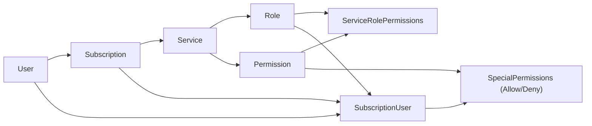
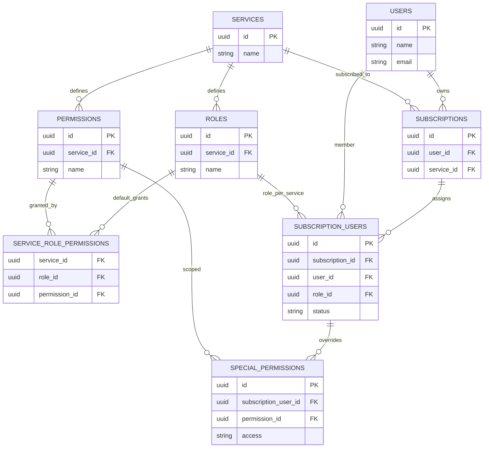

# Schema Diagrams

## Simple Flow Diagram

## EER Diagram

## Sample Data (Illustrative)

**Users**

| id | name | email | title |
| --- | --- | --- | --- |
| u_umesh | Umesh | umesh@company.com | CTO |
| u_shyam | Shyam | shyam@company.com | Team Lead |
| u_raju | Raju | raju@company.com | Junior Dev |

**Services**

| id | name |
| --- | --- |
| svc_ec2 | EC2 |
| svc_lambda | Lambda |
| svc_cassandra | Cassandra |

**Roles**

| id | service_id | name |
| --- | --- | --- |
| role_ec2_admin | svc_ec2 | ADMIN |
| role_ec2_user | svc_ec2 | USER |
| role_cass_admin | svc_cassandra | ADMIN |
| role_cass_user | svc_cassandra | USER |

**Permissions**

| id | service_id | name |
| --- | --- | --- |
| perm_ec2_start | svc_ec2 | START_INSTANCE |
| perm_ec2_stop | svc_ec2 | STOP_INSTANCE |
| perm_ec2_sudo | svc_ec2 | SUDO_ACCESS |
| perm_cass_create_schema | svc_cassandra | CREATE_SCHEMA |
| perm_cass_drop_schema | svc_cassandra | DROP_SCHEMA |
| perm_cass_create_table | svc_cassandra | CREATE_TABLE |
| perm_cass_drop_table | svc_cassandra | DROP_TABLE |
| perm_cass_dml | svc_cassandra | DML |
| perm_cass_dql | svc_cassandra | DQL |

**Service Role Permissions (defaults)**

| service_id | role_id | permission_id |
| --- | --- | --- |
| svc_ec2 | role_ec2_admin | perm_ec2_start |
| svc_ec2 | role_ec2_admin | perm_ec2_stop |
| svc_ec2 | role_ec2_admin | perm_ec2_sudo |
| svc_ec2 | role_ec2_user | perm_ec2_start |
| svc_ec2 | role_ec2_user | perm_ec2_stop |
| svc_cassandra | role_cass_admin | perm_cass_create_schema |
| svc_cassandra | role_cass_admin | perm_cass_drop_schema |
| svc_cassandra | role_cass_admin | perm_cass_create_table |
| svc_cassandra | role_cass_admin | perm_cass_drop_table |
| svc_cassandra | role_cass_admin | perm_cass_dml |
| svc_cassandra | role_cass_admin | perm_cass_dql |
| svc_cassandra | role_cass_user | perm_cass_dml |
| svc_cassandra | role_cass_user | perm_cass_dql |

**Subscriptions**

| id | user_id | service_id |
| --- | --- | --- |
| sub_ec2_umesh | u_umesh | svc_ec2 |
| sub_cass_umesh | u_umesh | svc_cassandra |

**Subscription Users**

| id | subscription_id | user_id | role_id |
| --- | --- | --- | --- |
| subu_shyam_ec2 | sub_ec2_umesh | u_shyam | role_ec2_admin |
| subu_shyam_cass | sub_cass_umesh | u_shyam | role_cass_admin |
| subu_raju_ec2 | sub_ec2_umesh | u_raju | role_ec2_user |

**Special Permissions (Overrides)**

| id | subscription_user_id | permission_id | access |
| --- | --- | --- | --- |
| sp1 | subu_raju_ec2 | perm_ec2_start | ALLOWED |
| sp2 | subu_raju_ec2 | perm_ec2_stop | ALLOWED |
| sp3 | subu_shyam_cass | perm_cass_drop_schema | DENIED |
