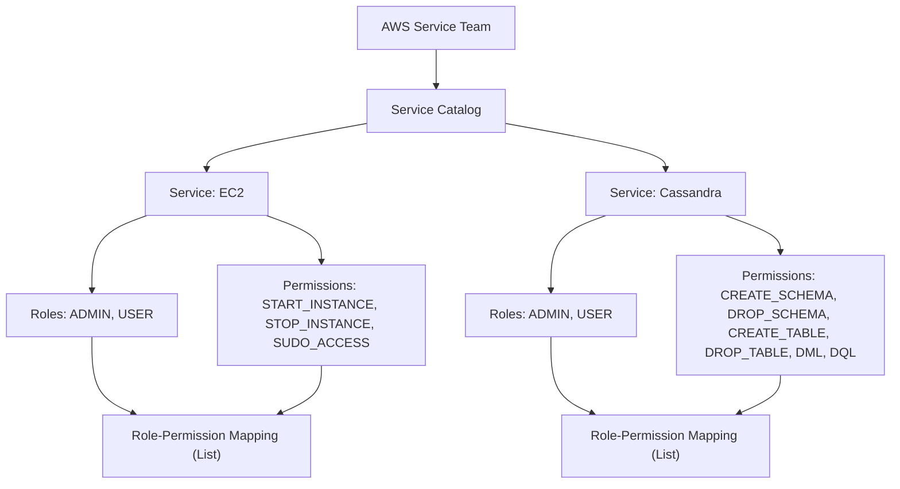
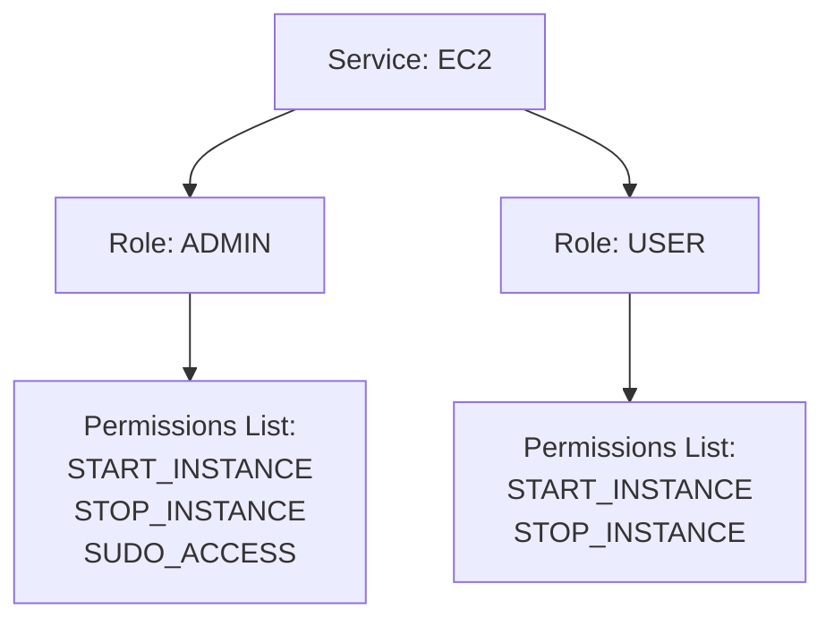
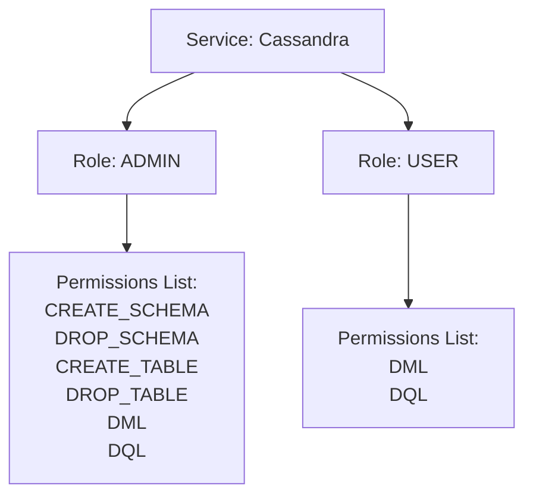

# AWS Service Team Flow (Pictorial)

## Visual: Service Team Defines Roles and Permissions

```mermaid
flowchart TB
  TEAM["AWS Service Team"] --> CATALOG["Service Catalog"]

  CATALOG --> EC2["Service: EC2"]
  CATALOG --> CAS["Service: Cassandra"]

  EC2 --> EC2_ROLES["Roles: ADMIN, USER"]
  EC2 --> EC2_PERMS["Permissions: START_INSTANCE, STOP_INSTANCE, SUDO_ACCESS"]
  EC2_ROLES --> EC2_MAP["Role-Permission Mapping (List)"]
  EC2_PERMS --> EC2_MAP

  CAS --> CAS_ROLES["Roles: ADMIN, USER"]
  CAS --> CAS_PERMS["Permissions: CREATE_SCHEMA, DROP_SCHEMA, CREATE_TABLE, DROP_TABLE, DML, DQL"]
  CAS_ROLES --> CAS_MAP["Role-Permission Mapping (List)"]
  CAS_PERMS --> CAS_MAP
```

## Visual: EC2 Roles and Permission Mapping

```mermaid
flowchart TB
  EC2["Service: EC2"]

  EC2 --> EC2_ADMIN["Role: ADMIN"]
  EC2 --> EC2_USER["Role: USER"]

  EC2_ADMIN --> EC2_ADMIN_PERMS["Permissions List:\nSTART_INSTANCE\nSTOP_INSTANCE\nSUDO_ACCESS"]
  EC2_USER --> EC2_USER_PERMS["Permissions List:\nSTART_INSTANCE\nSTOP_INSTANCE"]
```

## Visual: Cassandra Roles and Permission Mapping

```mermaid
flowchart TB
  CAS["Service: Cassandra"]

  CAS --> CAS_ADMIN["Role: ADMIN"]
  CAS --> CAS_USER["Role: USER"]

  CAS_ADMIN --> CAS_ADMIN_PERMS["Permissions List:\nCREATE_SCHEMA\nDROP_SCHEMA\nCREATE_TABLE\nDROP_TABLE\nDML\nDQL"]
  CAS_USER --> CAS_USER_PERMS["Permissions List:\nDML\nDQL"]
```
