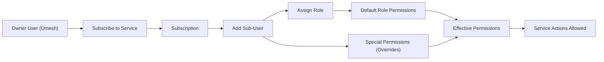
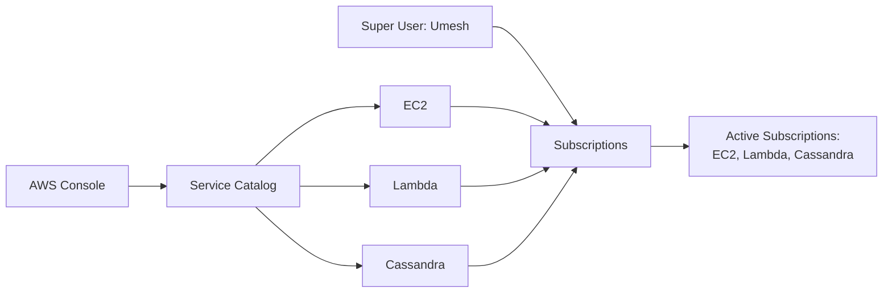
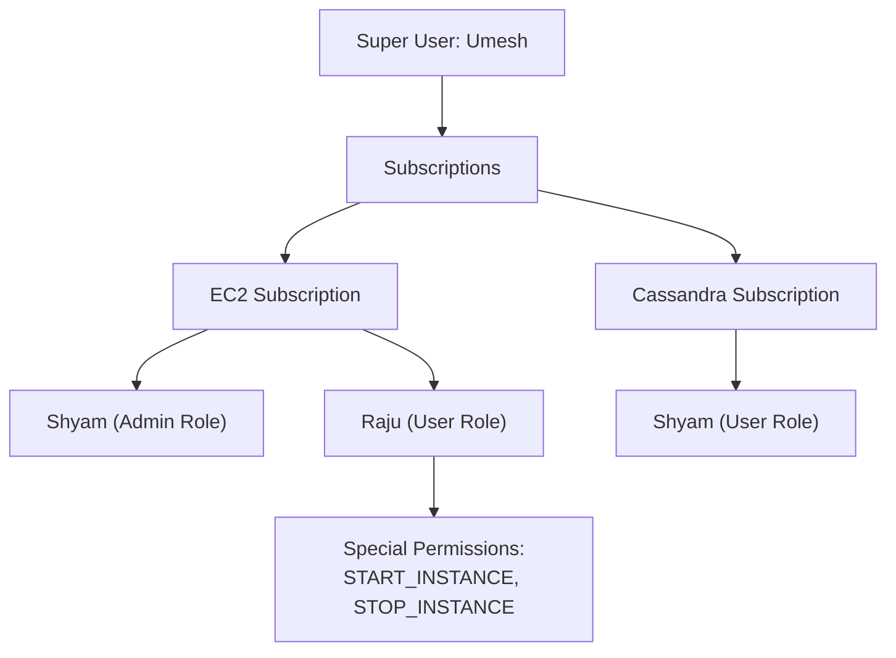
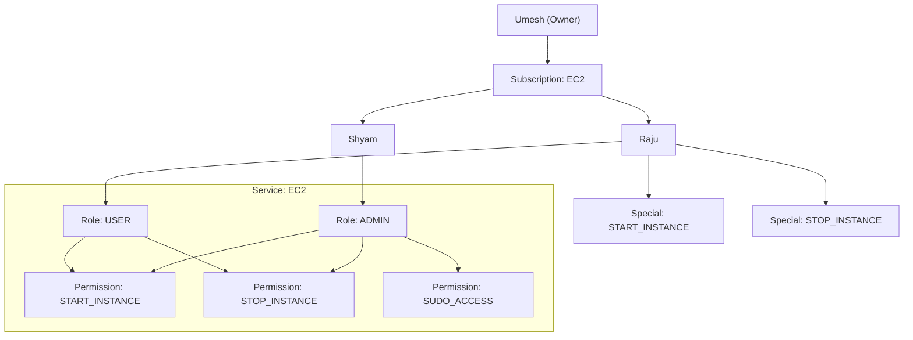
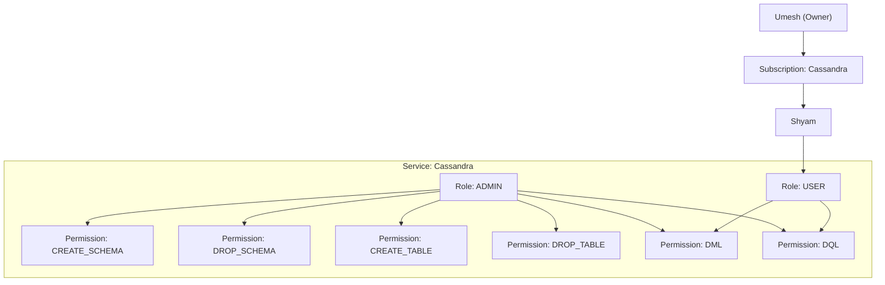
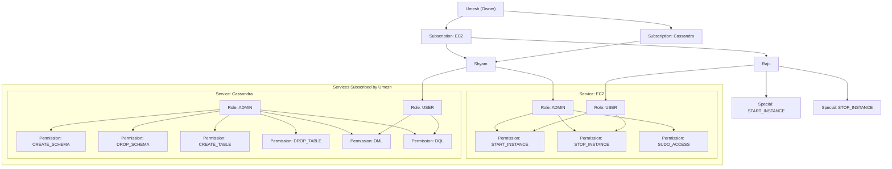

# User Flow (Pictorial)

## Access Flow

## Visual 1: Super User Subscribes to Services

## Visual 2: Super User Adds Team to Subscriptions

## Example (Split) - EC2

## Example (Split) - Cassandra

## Example (Umesh, Shyam, Raju) - Full (Top to Bottom)

