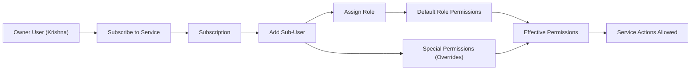
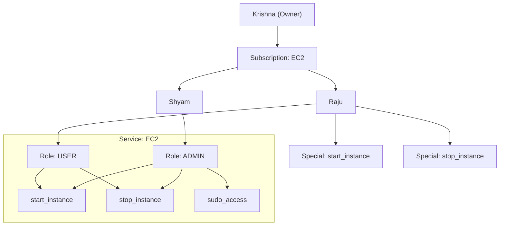

# Functional Overview (Pictorial)

## Access Flow

```mermaid
flowchart LR
  A["Owner User (Krishna)"] --> B["Subscribe to Service"]
  B --> C[Subscription]
  C --> D[Add Sub-User]
  D --> E[Assign Role]
  E --> F[Default Role Permissions]
  D --> G["Special Permissions (Overrides)"]
  F --> H[Effective Permissions]
  G --> H
  H --> I[Service Actions Allowed]
```

## Example (Krishna, Shyam, Raju)

```mermaid
flowchart TB
  subgraph EC2[Service: EC2]
    role_admin[Role: ADMIN]
    role_user[Role: USER]
    perm_start[start_instance]
    perm_stop[stop_instance]
    perm_sudo[sudo_access]
    role_admin --> perm_start
    role_admin --> perm_stop
    role_admin --> perm_sudo
    role_user --> perm_start
    role_user --> perm_stop
  end

  krishna["Krishna (Owner)"] --> sub_ec2["Subscription: EC2"]
  sub_ec2 --> shyam[Shyam]
  sub_ec2 --> raju[Raju]
  shyam --> role_admin
  raju --> role_user
  raju --> sp_start["Special: start_instance"]
  raju --> sp_stop["Special: stop_instance"]
```
